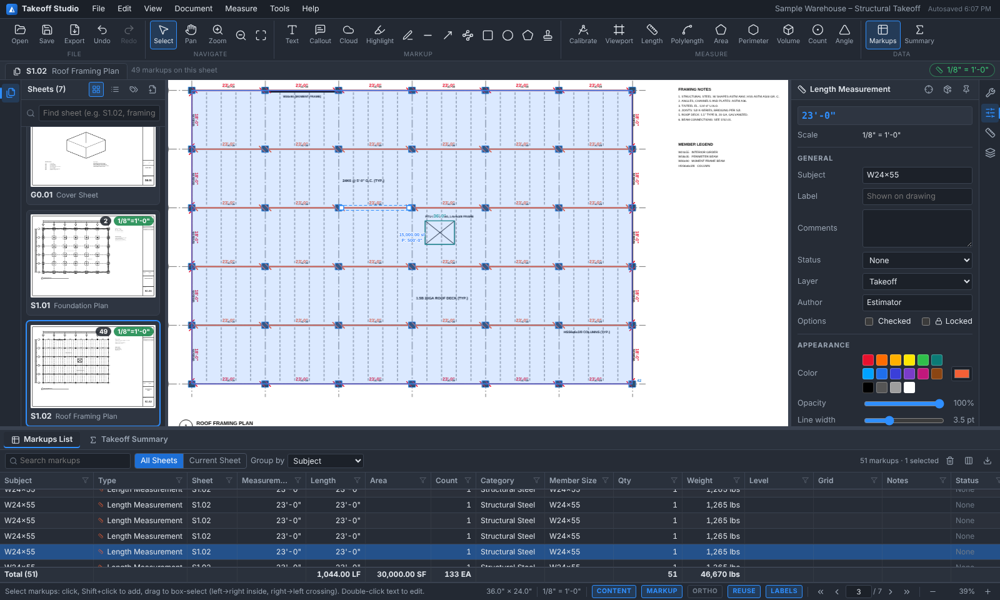
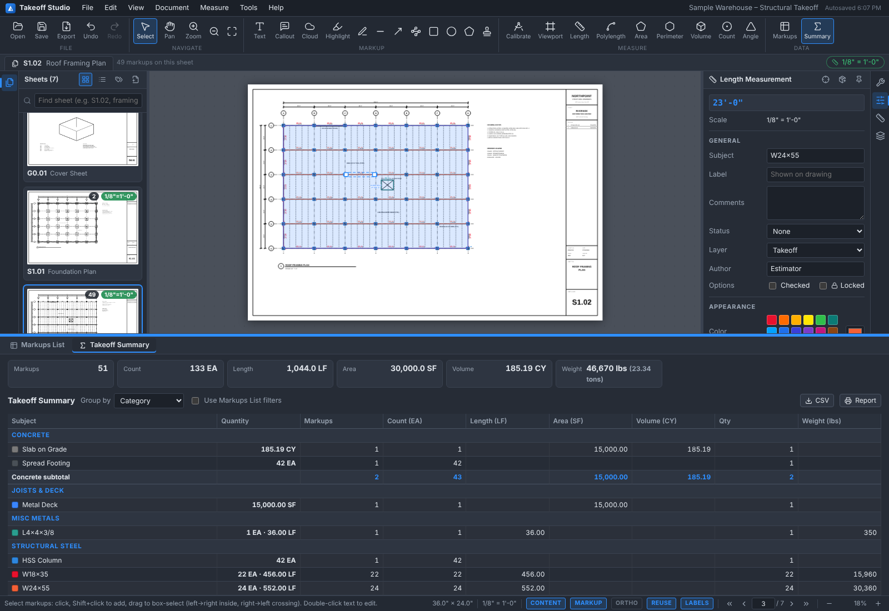

# Takeoff Studio

A browser-based construction-drawing **measurement, markup and quantity takeoff** workspace modelled closely on the
Bluebeam Revu Extreme estimating workflow. Drop in a PDF drawing set, label the sheets, calibrate scales, measure and
count with standardized Tool Chest tools, and work with every quantity in an editable, filterable markup database that
stays linked to the drawing.

> Independent implementation inspired by the Revu workflow. Not affiliated with or endorsed by Bluebeam, Inc.





## Quick start

```bash
npm install
npm run dev          # http://localhost:5173  (add ?sample to auto-open the sample set)
```

On the start screen choose **Open Sample Drawing Set** (a 7-sheet warehouse set with foundation and framing plans,
details at mixed scales, architectural and MEP sheets), or open / drop your own PDFs.

A five-minute tour with the sample set:

1. **Sheets panel (left)** – sheet numbers and titles (`S1.01 – Foundation Plan`, …) were read from the title blocks.
2. Open **S1.01**, click **Calibrate**, click both ends of the `20'-0"` dimension string at the left of grids 1–2, type
   `20'-0"`, choose *Apply to: All sheets* → the sheet reads `1/8" = 1'-0"`.
3. Open **S1.02 Roof Framing Plan**. In the **Tool Chest** (right) click **W24x55** and click beam ends along a grid
   line. Click **HSS6x6x3/8 Column** and click each column – every click adds to one count. Use **Metal Deck** to trace
   the roof area (double-click or Enter to finish).
4. The **Markups List** (bottom) now holds every takeoff object with Subject, Sheet, Length/Area/Count, Category,
   Member Size, Qty and a computed **Weight**. Click a row to jump to the markup; click a markup to find its row.
5. Open **Takeoff Summary** for totals by category/subject (e.g. `W24x55 — 24 EA · 552.00 LF`, `30,360 lbs`), then
   export CSV, a printable report, or a flattened PDF.

## How the requested workflow maps to the app

| Workflow step | Where it lives |
| --- | --- |
| **1. Sheet labeling & organization** | Sheets panel: thumbnails/list, search, drag to reorder, double-click to rename. *Document → Page Labels*: auto-detect from title blocks, read number/title from a boxed title-block region on every page, sequential numbering, or edit in a table. Multiple PDFs combine into one sheet set. |
| **2. Scale calibration** | *Calibrate* (two points + known distance such as `20'-0"`, `20-6`, `6.1 m`), *Set Scale* (architectural, engineering and metric presets or custom), apply to one / all / unscaled sheets. **Viewports** give a rectangular area of a sheet its own scale (details drawn at 1½" = 1'-0" next to a 1/4" section). Units: ft-in, decimal ft, in, m, cm, mm with selectable precision. |
| **3. Linear measurements** | Length and Polylength tools; results are persistent markup objects you can select, move, reshape by dragging vertices, restyle and inspect. Snaps to PDF line work (endpoints, midpoints, intersections, lines), to markup vertices, and Shift/ORTHO constrain angles. |
| **4. Area & perimeter** | Area (with perimeter shown), Perimeter, Volume (area × depth, CY/CF/m³), Angle; area **cutouts** for openings. |
| **5. Count** | Count tool: every click adds a symbol to the same count markup (circle, square, triangle, diamond, star, check, cross). |
| **6. Custom markup tools** | **Tool Chest** with default sets (Structural Steel, Joists/Deck/Connections, Misc Metals, Concrete, Architectural & MEP, Review). Each tool stores type, subject, appearance, layer, depth and **column values** (Member Size, Grade, Category, Qty…). Create tools from scratch or from any markup, edit, duplicate, move between sets, import/export JSON. *Apply Tool Properties* restyles existing markups. |
| **7. Editable Markup List** | Bottom panel. Double-click cells to edit Subject, Label, Comments, Status, Layer, Color, Author, Depth and every custom column; checkmark toggles. Multi-select edits apply to all selected rows. Undo/redo everything. |
| **8. Custom columns & data fields** | *Manage Columns*: Text, Number, Choice and **Formula** columns, ships with a structural-steel template (Piece Mark, Member Size, Material, Grade, Qty, Weight, Level, Grid, Detail, Connection, Labor Category, Notes, Category). Show/hide and reorder any column, resize by dragging headers. |
| **9. Sort, filter, group** | Click headers to sort, funnel icons for per-column value filters, search box, *Current Sheet* scope, *Group by* any text/choice column with per-group subtotals and a totals row. |
| **10. Drawing ⇄ data link** | Selecting a row navigates to its sheet, zooms and flashes the markup; selecting on the drawing highlights and scrolls to the row. Hover a markup for a quick readout. |
| **11. Takeoff summary** | Totals per subject grouped by Category (or any column): pieces (EA), length (LF), area (SF), volume (CY), Qty and every numeric/formula column (e.g. weight in lbs and tons). Click a line to select its markups. |
| **12. Export / report** | Markups CSV, summary CSV, printable summary report (save as PDF from the print dialog), flattened PDF with markups and measurement labels burned in, and portable project files (`.takeoff.json`, drawings embedded). |

### Formula columns

Formulas reference columns by name – `Length` (LF), `Area` (SF), `Volume` (CY), `Count`, `Depth`, `Perimeter`, `Subject`,
or any custom column (`Qty`, `[Member Size]`) – with `+ - * / ^`, comparisons, `&` (text join) and
`IF, ROUND, ROUNDUP, ROUNDDOWN, CEILING, FLOOR, MIN, MAX, ABS, SQRT, AND, OR, NOT, CONCAT`.

Steel helpers: `PLF(shape)` returns lb/ft for W, M, S, HP, C, MC, WT shapes (from the designation), HSS (rectangular and
round), angles, flat bar, rod, pipe and common K-series joists; `PSF(plate)` returns lb/ft² for plate (`PL1/2`,
`1/2" Plate`). The default Weight column is

```
Qty * (Length * PLF([Member Size]) + Area * PSF([Member Size]))
```

Report units (LF/in/m, SF/SY/m², CY/CF/m³) and decimals are set in the **Measurements** panel.

### Keyboard

| Keys | Action |
| --- | --- |
| `V` / hold `Space` / middle-drag | Select / pan |
| Wheel, `Ctrl+0`, `Ctrl+9`, `Ctrl+=`/`-`, `Z` | Zoom at cursor, fit page, fit width, zoom in/out, zoom rectangle |
| `PgUp` / `PgDn` | Previous / next sheet |
| `Shift+Alt+K L M A P V C G` | Calibrate, Length, Polylength, Area, Perimeter, Volume, Count, Angle |
| `T Q C R E L A N G P H` | Text, Callout, Cloud, Rectangle, Ellipse, Line, Arrow, Polyline, Polygon, Pen, Highlight |
| `Enter` / double-click / right-click | Finish a multi-point markup; `Backspace` removes the last point; `Esc` cancels |
| `Ctrl+Z` `Ctrl+Y` `Ctrl+C` `Ctrl+V` `Ctrl+D` `Del` | Undo, redo, copy, paste, duplicate, delete |
| Arrow keys (`Shift` ×10) | Nudge selection |

Status-bar toggles: **CONTENT** (snap to PDF geometry), **MARKUP** (snap to markup vertices), **ORTHO**, **REUSE** (keep the
tool active), **LABELS** (measurement labels on the drawing).

## Data & persistence

* Everything runs locally in the browser; nothing is uploaded.
* The open project autosaves to IndexedDB and is restored on reload.
* *File → Save Project As…* writes a single `.takeoff.json` containing the PDFs and all takeoff data; open it with
  *File → Open Project…* or drag it onto the window.
* The Tool Chest, list layout and preferences are stored per browser (localStorage) and shared across projects.

## Development

```bash
npm run dev        # Vite dev server
npm run build      # type-check + production build to dist/
npm test           # unit tests (units, parsing, scales, geometry, formulas, steel weights, rows)
npm run test:e2e   # Playwright end-to-end tests against the sample drawing set
npm run sample     # regenerate public/samples/Sample-Structural-Set.pdf
```

Stack: React 18, TypeScript, Vite, Zustand, pdf.js (rendering, text and vector extraction), pdf-lib (export), lucide icons.

```
src/
  core/            framework-free logic
    units.ts         ft-in / metric formatting & parsing, scale presets, calibration
    geometry.ts      lengths, areas, centroids, hit-testing helpers, clouds
    measure.ts       per-markup scale resolution (sheet vs viewport) and measurements
    formula.ts       safe expression parser/evaluator for formula columns
    steelShapes.ts   PLF/PSF weight lookup
    columns.ts       built-in + custom column model, row building for the list
    summary.ts       takeoff summary aggregation
    pdf.ts           pdf.js loading, rendering, title-block text, snap index
    export.ts        CSV, printable report, flattened PDF
  store/           Zustand store (undo/redo history), project I/O, autosave, commands
  components/      viewer (canvas + SVG markup layer), panels, markups list, summary, dialogs
```

Rendering uses a resolution-capped base canvas plus a high-resolution "detail" canvas for the visible region, so large
sheets stay sharp at high zoom. Markups are SVG in PDF point space, so the drawing and the data are two views of one
model: every list cell is computed from the same markup objects that are drawn.

### Known limitations

* Scanned (raster) PDFs have no text layer: title-block reading and content snapping need vector PDFs; enter labels by
  hand and rely on markup snapping for scans.
* Markups are stored in the project, not written back into the PDF as native annotations; use the flattened PDF export
  to share marked-up drawings.
* Single user; there is no Studio-style real-time collaboration.
